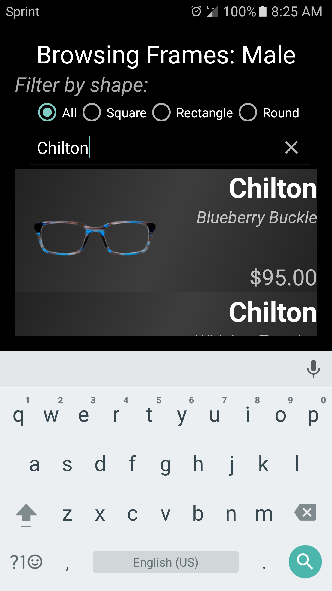

# eyeware
Eyeware (2016) is an Android app developed in partial fulfillment of C. Brito's Bachelor of Science degree in Mathematics as a final project. This Github repository contains the source code used to develop the application. Some base code used is licensed under AOSP's Apache 2.0 license and an effort has been made to indicate these snippets.

Eyeware was intended to be a (creative) solution for shopping for eyeglasses at home and a tech demo was developed to fill an absence of any apps on the Play store at the time. Progress halted in August 2016 due to time commitments and is provided as a historical anecdote. Since then, Snapchat came out with various Lenses that mimic what this app was designed to do, and other apps have followed inspiration.

The Eyeware app was designed to be "intuitive" for users to pick up and use immediately, given that their phone has the correct Google Play Services software installed. Human-Computer interaction and UX was put first in developing the app, keeping the number of options and buttons to an absolute minimum while still allowing the user to get where they want to go in the quickest time possible. This is immediately seen in the welcome screen:

Users are able to search for glasses frames after tapping any of the four buttons. In particular, we can search for the Chilton glasses in the male section and see what's available:

  
A picture of each of the frames is displayed along with its color name and price. Users then tap on any pair of frames they'd like to try on. From here, augmented reality using Google's Vision API kicks in.

A first for any app at the time, users are able to preview the frames on their face **in real time**. The frames will move with the user's face, and scale and rotate appropriately depending on the 3D orientation of the user's head. The app also measured the user's "happiness" level from the Vision API to gauge user interest in the selected frames. In the interest of keeping the number of buttons to a minimum and fully engage the user, users could smile to both add the worn frames to "Favorites" and take a photo of them wearing the frames. This option was unchecked by default in respect of the user's privacy.

If the user is satisfied with the frames they selected, they may proceed to checkout directly within the app. 

The checkout screen is a simplified mockup of what could be expected were the app actually connected to a vendor or store. The selected frames are displayed at the top to help ensure the user is buying the frames they selected (a different pair is shown here than from the previous screen for variety purposes).

The app also featured context-sensitive menus that changed depending on certain conditions. More specifically, the app only had four screens: 1) The welcome screen, 2) the selection screen, 3) the AR tryon screen, and 4) the checkout screen. Here, we can see that the selection screen changes appropriately whether they are shopping by gender or keyword, searching by frame type, searching in favorites, and such. If the user has no favorites, the screen will appropriately notify the user. If the user has favorites logged, they may clear their choices using a button that appears only when the user has selected "Favorites".

Searching by keyword

  

All frames are copyright Warby Parker. The express written consent to use modified images of Warby Parker's available frame lineup from Summer 2016 was obtained from their Press department and is presented here under their permission.
